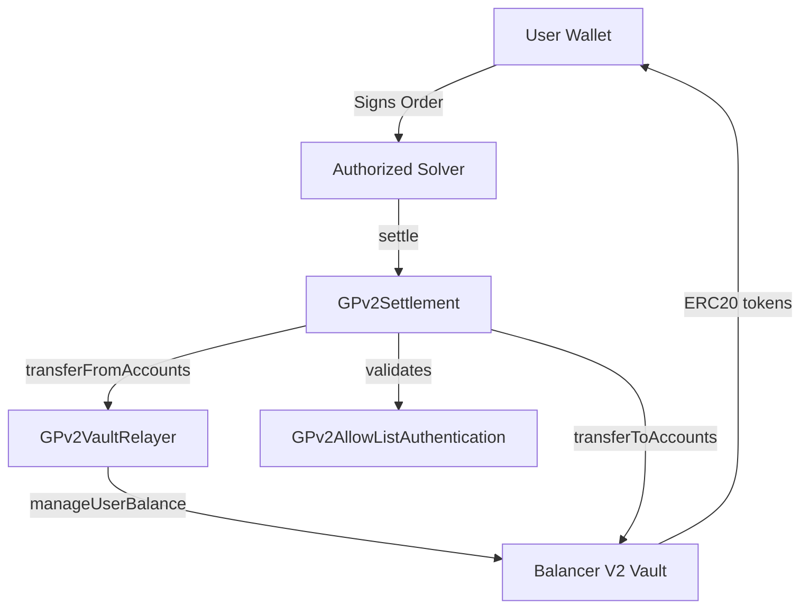

## Overview

CoW Protocol's smart contract architecture is built around three core contracts that work together to enable batch auction settlements with MEV protection. The system leverages Balancer V2's Vault for secure fund management while maintaining a permissioned solver network.

## Core Components

<CardGroup cols={3}>
  <Card title="GPv2Settlement" icon="building">
    The main contract orchestrating trade execution, order validation, and settlement logic
  </Card>
  <Card title="GPv2VaultRelayer" icon="arrows-rotate">
    Intermediary contract managing token transfers between users and the Balancer Vault
  </Card>
  <Card title="GPv2AllowListAuthentication" icon="shield-check">
    Access control system managing the permissioned solver network
  </Card>
</CardGroup>

## Architecture Diagram



## Contract Relationships

### GPv2Settlement (src/contracts/GPv2Settlement.sol:21)

The settlement contract is the protocol's entry point, responsible for:

- **Order Validation**: Verifies signatures, expiry times, and limit prices
- **Trade Execution**: Computes clearing prices and executes batched trades
- **Interaction Hooks**: Allows arbitrary contract calls before, during, and after settlements
- **Reentrancy Protection**: Inherits from `ReentrancyGuard` to prevent attacks

```solidity src/contracts/GPv2Settlement.sol
contract GPv2Settlement is GPv2Signing, ReentrancyGuard, StorageAccessible {
    /// @dev The authenticator determines who can call settle
    GPv2Authentication public immutable authenticator;

    /// @dev The Balancer Vault for managing user funds
    IVault public immutable vault;

    /// @dev The Vault relayer for token transfers
    GPv2VaultRelayer public immutable vaultRelayer;

    /// @dev Tracks filled amounts per order UID
    mapping(bytes => uint256) public filledAmount;
}
```

### GPv2VaultRelayer (src/contracts/GPv2VaultRelayer.sol:11)

The vault relayer acts as a trusted intermediary:

```solidity src/contracts/GPv2VaultRelayer.sol
contract GPv2VaultRelayer {
    /// @dev Only the creator (GPv2Settlement) can call this contract
    address private immutable creator;

    /// @dev The Balancer Vault instance
    IVault private immutable vault;

    /// @dev Transfers tokens from user accounts to the settlement
    function transferFromAccounts(
        GPv2Transfer.Data[] calldata transfers
    ) external onlyCreator {
        vault.transferFromAccounts(transfers, msg.sender);
    }
}
```

<Info>
The VaultRelayer is created during `GPv2Settlement` deployment and is the only address authorized to pull funds from users' Balancer Vault allowances.
</Info>

### GPv2AllowListAuthentication (src/contracts/GPv2AllowListAuthentication.sol:11)

Manages solver permissions through an allowlist:

```solidity src/contracts/GPv2AllowListAuthentication.sol
contract GPv2AllowListAuthentication is GPv2Authentication, Initializable {
    /// @dev Manager who can add/remove solvers
    address public manager;

    /// @dev Allowlist mapping
    mapping(address => bool) private solvers;

    /// @inheritdoc GPv2Authentication
    function isSolver(
        address prospectiveSolver
    ) external view override returns (bool) {
        return solvers[prospectiveSolver];
    }
}
```

<Warning>
Only addresses added to the solver allowlist by the manager can call `settle()` on the GPv2Settlement contract.
</Warning>

## Token Flow

The architecture ensures secure token handling through a multi-step process:

### 1. User Approval
Users approve the Balancer Vault (not the settlement contract) to spend their tokens.

### 2. Inbound Transfers
```solidity
vaultRelayer.transferFromAccounts(inTransfers);
```
Tokens are pulled from users into the settlement contract.

### 3. Interactions (Optional)
```solidity
executeInteractions(interactions[1]);
```
Arbitrary contract calls can be made (e.g., to DEX aggregators).

### 4. Outbound Transfers
```solidity
vault.transferToAccounts(outTransfers);
```
Tokens are distributed to order receivers.

## Security Features

<AccordionGroup>
  <Accordion title="Reentrancy Protection">
    The settlement contract uses the `nonReentrant` modifier on all entry points to prevent reentrancy attacks during token transfers and interactions.
  </Accordion>
  
  <Accordion title="Solver Authorization">
    The `onlySolver` modifier ensures only allowlisted addresses can execute settlements, preventing unauthorized batch execution.
  </Accordion>
  
  <Accordion title="Interaction Restrictions">
    The VaultRelayer cannot be called as an interaction target to prevent attacks on user funds:
    ```solidity
    require(
        interaction.target != address(vaultRelayer),
        "GPv2: forbidden interaction"
    );
    ```
  </Accordion>
  
  <Accordion title="Creator-Only Access">
    The VaultRelayer enforces that only its creator (the Settlement contract) can invoke transfers:
    ```solidity
    modifier onlyCreator() {
        require(msg.sender == creator, "GPv2: not creator");
        _;
    }
    ```
  </Accordion>
</AccordionGroup>

## Immutable References

Critical contract addresses are stored as immutable variables set during deployment:

```solidity
GPv2Authentication public immutable authenticator;
IVault public immutable vault;
GPv2VaultRelayer public immutable vaultRelayer;
```

<Info>
Immutable variables are embedded in the contract bytecode at deployment, making them gas-efficient and impossible to modify.
</Info>

## Design Principles

1. **Separation of Concerns**: Each contract handles a specific responsibility
2. **Minimal Trust**: Users only approve the Balancer Vault, a battle-tested DeFi primitive
3. **Gas Efficiency**: Batch settlements amortize gas costs across multiple orders
4. **Extensibility**: Interaction hooks enable future protocol upgrades without redeployment
5. **MEV Protection**: Uniform clearing prices prevent sandwich attacks within batches
