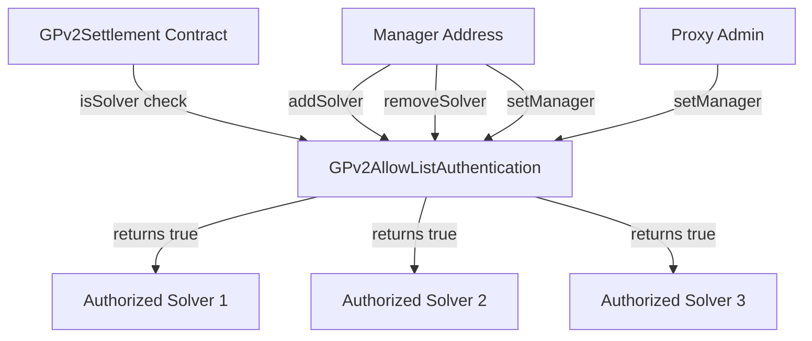
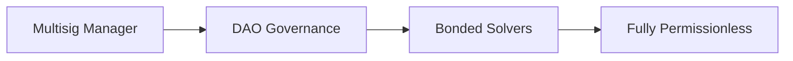

## Overview

CoW Protocol uses a permission-based authentication system to control who can execute settlements. This design ensures that only trusted, vetted solvers can interact with user orders, providing security during the protocol's early stages while maintaining a path to decentralization.

## Authentication Architecture



## GPv2Authentication Interface

The core authentication interface defines a single method:

```solidity src/contracts/interfaces/GPv2Authentication.sol
interface GPv2Authentication {
    function isSolver(address prospectiveSolver) external view returns (bool);
}
```

<Info>
This simple interface allows different authentication implementations to be used without changing the settlement contract.
</Info>

## GPv2AllowListAuthentication Contract

The default implementation uses an allowlist approach:

```solidity src/contracts/GPv2AllowListAuthentication.sol
contract GPv2AllowListAuthentication is
    GPv2Authentication,
    Initializable,
    StorageAccessible
{
    /// @dev Manager who can add/remove solvers
    address public manager;

    /// @dev Allowlist of authorized solvers
    mapping(address => bool) private solvers;

    /// @inheritdoc GPv2Authentication
    function isSolver(
        address prospectiveSolver
    ) external view override returns (bool) {
        return solvers[prospectiveSolver];
    }
}
```

## Role Hierarchy

<CardGroup cols={2}>
  <Card title="Proxy Admin" icon="crown">
    Highest authority. Can upgrade the contract and change the manager. Typically a multisig or DAO.
  </Card>
  <Card title="Manager" icon="user-shield">
    Operational role. Can add/remove solvers from the allowlist. Handles day-to-day authorization.
  </Card>
  <Card title="Solver" icon="gears">
    Execution role. Can call `settle()` to execute batch auctions. Must be explicitly authorized.
  </Card>
</CardGroup>

## Manager Operations

### Setting the Manager

```solidity src/contracts/GPv2AllowListAuthentication.sol
modifier onlyManagerOrOwner() {
    require(
        manager == msg.sender || GPv2EIP1967.getAdmin() == msg.sender,
        "GPv2: not authorized"
    );
    _;
}

function setManager(address manager_) external onlyManagerOrOwner {
    address oldManager = manager;
    manager = manager_;
    emit ManagerChanged(manager_, oldManager);
}
```

<Warning>
Both the current manager and the proxy admin can change the manager. This allows the admin to intervene in emergencies.
</Warning>

### Initializing the Manager

```solidity src/contracts/GPv2AllowListAuthentication.sol
function initializeManager(address manager_) external initializer {
    manager = manager_;
    emit ManagerChanged(manager_, address(0));
}
```

<Note>
The initializer pattern allows the contract to be deployed behind a proxy. It can only be called once.
</Note>

## Solver Management

### Adding a Solver

```solidity src/contracts/GPv2AllowListAuthentication.sol
modifier onlyManager() {
    require(manager == msg.sender, "GPv2: caller not manager");
    _;
}

function addSolver(address solver) external onlyManager {
    solvers[solver] = true;
    emit SolverAdded(solver);
}
```

### Removing a Solver

```solidity src/contracts/GPv2AllowListAuthentication.sol
function removeSolver(address solver) external onlyManager {
    solvers[solver] = false;
    emit SolverRemoved(solver);
}
```

<Info>
Both `addSolver` and `removeSolver` are idempotent - calling them multiple times has the same effect as calling once.
</Info>

## Settlement Authorization

The settlement contract enforces solver authorization at the entry point:

```solidity src/contracts/GPv2Settlement.sol
/// @dev The authenticator determines who can call settle
GPv2Authentication public immutable authenticator;

modifier onlySolver() {
    require(authenticator.isSolver(msg.sender), "GPv2: not a solver");
    _;
}

function settle(
    IERC20[] calldata tokens,
    uint256[] calldata clearingPrices,
    GPv2Trade.Data[] calldata trades,
    GPv2Interaction.Data[][3] calldata interactions
) external nonReentrant onlySolver {
    // Settlement logic...
    emit Settlement(msg.sender);
}

function swap(
    IVault.BatchSwapStep[] calldata swaps,
    IERC20[] calldata tokens,
    GPv2Trade.Data calldata trade
) external nonReentrant onlySolver {
    // Direct swap logic...
}
```

<Warning>
Without passing the `onlySolver` check, transactions to `settle()` or `swap()` will revert with "GPv2: not a solver".
</Warning>

## Events

Authentication operations emit events for monitoring:

### Manager Events

```solidity src/contracts/GPv2AllowListAuthentication.sol
event ManagerChanged(address newManager, address oldManager);
```

Emitted when the manager address changes.

### Solver Events

```solidity src/contracts/GPv2AllowListAuthentication.sol
event SolverAdded(address solver);
event SolverRemoved(address solver);
```

Emitted when solvers are added to or removed from the allowlist.

### Settlement Event

```solidity src/contracts/GPv2Settlement.sol
event Settlement(address indexed solver);
```

Emitted after every successful settlement, identifying which solver executed it.

## Proxy Pattern & EIP-1967

The authentication contract uses the EIP-1967 proxy standard:

```solidity src/contracts/GPv2AllowListAuthentication.sol
import "./libraries/GPv2EIP1967.sol";

modifier onlyManagerOrOwner() {
    require(
        manager == msg.sender || GPv2EIP1967.getAdmin() == msg.sender,
        "GPv2: not authorized"
    );
    _;
}
```

<Info>
EIP-1967 defines a standard storage slot for the proxy admin address, enabling secure upgradeable contracts.
</Info>

## Security Considerations

### Immutable Authenticator

The authenticator address in the settlement contract is immutable:

```solidity src/contracts/GPv2Settlement.sol
GPv2Authentication public immutable authenticator;

constructor(GPv2Authentication authenticator_, IVault vault_) {
    authenticator = authenticator_;
    vault = vault_;
    vaultRelayer = new GPv2VaultRelayer(vault_);
}
```

<AccordionGroup>
  <Accordion title="Why Immutable?">
    Making the authenticator immutable prevents the settlement contract from being compromised by changing authentication logic after deployment. If the authentication system needs to change, a new settlement contract must be deployed.
  </Accordion>
  
  <Accordion title="Upgrade Path">
    The authentication contract itself can be behind a proxy, allowing the allowlist logic to be upgraded without redeploying the settlement contract. The manager system provides operational flexibility.
  </Accordion>
</AccordionGroup>

### Multi-Signature Recommendations

<Warning>
Best practices suggest using a multi-signature wallet or DAO governance contract for:
- **Proxy Admin**: Controls contract upgrades
- **Manager**: Controls solver allowlist

This distributes trust and prevents single points of failure.
</Warning>

## StorageAccessible Mixin

```solidity src/contracts/GPv2AllowListAuthentication.sol
contract GPv2AllowListAuthentication is
    GPv2Authentication,
    Initializable,
    StorageAccessible
{ }
```

The `StorageAccessible` mixin allows direct storage reads, useful for:
- Off-chain verification
- Integration with block explorers
- Debugging and monitoring

## Initialization Pattern

```solidity src/contracts/GPv2AllowListAuthentication.sol
function initializeManager(address manager_) external initializer {
    manager = manager_;
    emit ManagerChanged(manager_, address(0));
}
```

The `initializer` modifier (from `Initializable` mixin) ensures:

1. The function can only be called once
2. It must be called before other operations
3. Prevents re-initialization attacks on proxies

<Note>
This pattern is crucial for upgradeable contracts deployed behind proxies, where constructor logic doesn't work.
</Note>

## Checking Solver Status

Anyone can query if an address is an authorized solver:

```solidity
bool isAuthorized = authenticator.isSolver(0x1234...);
```

This is a `view` function that doesn't modify state or cost gas when called off-chain.

## Decentralization Path

The authentication system is designed for progressive decentralization:

### Phase 1: Centralized Allowlist
A small manager-controlled allowlist ensures security during initial launch.

### Phase 2: DAO Governance
Transition manager role to a DAO, requiring governance votes for solver changes.

### Phase 3: Permissionless (Potential)
Replace authentication contract with bond-based or reputation-based system allowing permissionless solver participation.



<Info>
The immutable authenticator in the settlement contract means moving to a new authentication model requires deploying a new settlement contract. This trade-off prioritizes security over flexibility.
</Info>

## Access Control Summary

| Role | Can | Cannot |
|------|-----|--------|
| **Proxy Admin** | - Upgrade contract<br/>- Change manager<br/>- Emergency interventions | - Add/remove solvers directly<br/>- Execute settlements |
| **Manager** | - Add solvers<br/>- Remove solvers<br/>- Transfer manager role | - Upgrade contract<br/>- Execute settlements |
| **Solver** | - Call settle()<br/>- Call swap()<br/>- Execute trades | - Modify allowlist<br/>- Access restricted functions |
| **User** | - Sign orders<br/>- Cancel orders<br/>- Check solver status | - Execute settlements<br/>- Modify protocol state |
