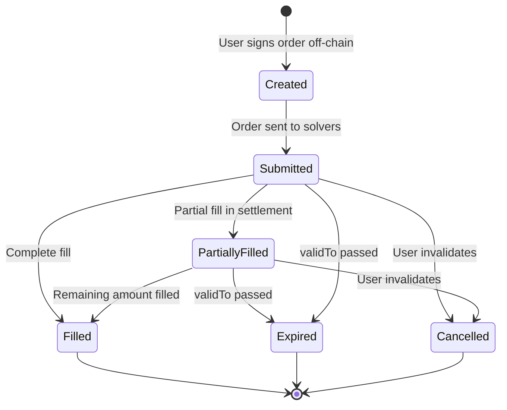

## Overview

Orders in CoW Protocol are intent-based trading instructions that specify what users want to trade without dictating how. The protocol uses EIP-712 typed signatures for secure, off-chain order creation.

## Order Structure

The complete order data structure contains all parameters needed for trade execution:

```solidity src/contracts/libraries/GPv2Order.sol
struct Data {
    IERC20 sellToken;           // Token to sell
    IERC20 buyToken;            // Token to buy
    address receiver;           // Recipient of buyToken (address(0) = owner)
    uint256 sellAmount;         // Amount to sell (excluding fees)
    uint256 buyAmount;          // Minimum amount to buy
    uint32 validTo;             // Expiration timestamp
    bytes32 appData;            // Application-specific data
    uint256 feeAmount;          // Protocol fee in sellToken
    bytes32 kind;               // Order kind: sell or buy
    bool partiallyFillable;     // Allow partial fills?
    bytes32 sellTokenBalance;   // How to source sellToken
    bytes32 buyTokenBalance;    // Where to send buyToken
}
```

## Order Parameters

### Token Pair

```solidity
IERC20 sellToken;  // The token being sold
IERC20 buyToken;   // The token being bought
```

These define the trading pair for the order.

### Amounts and Pricing

<CardGroup cols={2}>
  <Card title="Sell Orders" icon="arrow-right">
    Specify exact `sellAmount` (excluding fees). The protocol ensures you receive **at least** `buyAmount`.
    
    ```solidity
    kind = GPv2Order.KIND_SELL
    sellAmount = 1000e6  // Sell exactly 1000 USDC
    buyAmount = 0.4e18   // Get at least 0.4 WETH
    ```
  </Card>
  
  <Card title="Buy Orders" icon="arrow-left">
    Specify exact `buyAmount` to receive. The protocol ensures you spend **at most** `sellAmount` (plus fees).
    
    ```solidity
    kind = GPv2Order.KIND_BUY
    buyAmount = 1e18     // Buy exactly 1 WETH
    sellAmount = 2500e6  // Spend at most 2500 USDC
    ```
  </Card>
</CardGroup>

### Order Kinds

The `kind` field determines order semantics:

```solidity src/contracts/libraries/GPv2Order.sol
/// @dev Marker for sell orders
bytes32 internal constant KIND_SELL =
    hex"f3b277728b3fee749481eb3e0b3b48980dbbab78658fc419025cb16eee346775";

/// @dev Marker for buy orders
bytes32 internal constant KIND_BUY =
    hex"6ed88e868af0a1983e3886d5f3e95a2fafbd6c3450bc229e27342283dc429ccc";
```

<Info>
These are keccak256 hashes of "sell" and "buy" respectively, allowing EIP-712 wallets to display human-readable order kinds.
</Info>

### Receiver

```solidity src/contracts/libraries/GPv2Order.sol
/// @dev Marker indicating receiver is the order owner
address internal constant RECEIVER_SAME_AS_OWNER = address(0);
```

Set to `address(0)` to receive tokens at the signing address, or specify a different address to send proceeds elsewhere.

### Validity Period

```solidity
uint32 validTo;  // Unix timestamp
```

Orders automatically expire after this timestamp. The settlement contract validates:

```solidity src/contracts/GPv2Settlement.sol
require(order.validTo >= block.timestamp, "GPv2: order expired");
```

### Fee Amount

```solidity
uint256 feeAmount;  // Denominated in sellToken
```

The protocol fee is paid in the sell token. For sell orders, this is added on top of the `sellAmount`. For buy orders, it's deducted from the `sellAmount`.

<Note>
Fees are computed off-chain by the protocol's fee estimation service and included in the order signature.
</Note>

### Partial Fills

```solidity
bool partiallyFillable;
```

- `false` (default): Fill-or-kill orders must execute completely or not at all
- `true`: Orders can be filled across multiple settlements

### Balance Sources

CoW Protocol supports multiple balance locations via Balancer Vault:

```solidity src/contracts/libraries/GPv2Order.sol
/// @dev Use direct ERC20 balances
bytes32 internal constant BALANCE_ERC20 =
    hex"5a28e9363bb942b639270062aa6bb295f434bcdfc42c97267bf003f272060dc9";

/// @dev Use Balancer Vault external balances
bytes32 internal constant BALANCE_EXTERNAL =
    hex"abee3b73373acd583a130924aad6dc38cfdc44ba0555ba94ce2ff63980ea0632";

/// @dev Use Balancer Vault internal balances
bytes32 internal constant BALANCE_INTERNAL =
    hex"4ac99ace14ee0a5ef932dc609df0943ab7ac16b7583634612f8dc35a4289a6ce";
```

<AccordionGroup>
  <Accordion title="ERC20 Balance (Default)">
    Tokens are pulled directly from the user's wallet using standard ERC20 approvals to the Balancer Vault.
    ```solidity
    sellTokenBalance = BALANCE_ERC20
    buyTokenBalance = BALANCE_ERC20
    ```
  </Accordion>
  
  <Accordion title="External Balance">
    Uses Balancer Vault's external balance feature, which can be more gas efficient for users who frequently trade.
    ```solidity
    sellTokenBalance = BALANCE_EXTERNAL
    ```
  </Accordion>
  
  <Accordion title="Internal Balance">
    Tokens are deposited in and withdrawn from the Balancer Vault's internal balance system.
    ```solidity
    buyTokenBalance = BALANCE_INTERNAL
    ```
  </Accordion>
</AccordionGroup>

### App Data

```solidity
bytes32 appData;
```

Application-specific metadata stored on-chain with the order. This can encode:
- Referral information
- Order origin (dApp, aggregator, etc.)
- Custom execution preferences

## Order UID

Each order is uniquely identified by a 56-byte UID:

```solidity src/contracts/libraries/GPv2Order.sol
uint256 internal constant UID_LENGTH = 56;
```

The UID packs together:

```
[orderDigest (32 bytes)][owner (20 bytes)][validTo (4 bytes)]
```

### Computing the UID

```solidity src/contracts/libraries/GPv2Order.sol
function packOrderUidParams(
    bytes memory orderUid,
    bytes32 orderDigest,
    address owner,
    uint32 validTo
) internal pure {
    require(orderUid.length == UID_LENGTH, "GPv2: uid buffer overflow");
    
    assembly {
        mstore(add(orderUid, 56), validTo)
        mstore(add(orderUid, 52), owner)
        mstore(add(orderUid, 32), orderDigest)
    }
}
```

### Extracting UID Parameters

```solidity src/contracts/libraries/GPv2Order.sol
function extractOrderUidParams(
    bytes calldata orderUid
) internal pure returns (
    bytes32 orderDigest,
    address owner,
    uint32 validTo
) {
    require(orderUid.length == UID_LENGTH, "GPv2: invalid uid");
    
    assembly {
        orderDigest := calldataload(orderUid.offset)
        owner := shr(96, calldataload(add(orderUid.offset, 32)))
        validTo := shr(224, calldataload(add(orderUid.offset, 52)))
    }
}
```

## EIP-712 Signing

Orders are signed using EIP-712, enabling hardware wallet support and human-readable signatures:

```solidity src/contracts/libraries/GPv2Order.sol
/// @dev EIP-712 type hash for Order struct
bytes32 internal constant TYPE_HASH =
    hex"d5a25ba2e97094ad7d83dc28a6572da797d6b3e7fc6663bd93efb789fc17e489";
```

This is the keccak256 hash of:

```solidity
keccak256(
    "Order("
        "address sellToken,"
        "address buyToken,"
        "address receiver,"
        "uint256 sellAmount,"
        "uint256 buyAmount,"
        "uint32 validTo,"
        "bytes32 appData,"
        "uint256 feeAmount,"
        "string kind,"
        "bool partiallyFillable,"
        "string sellTokenBalance,"
        "string buyTokenBalance"
    ")"
)
```

### Computing Order Hash

```solidity src/contracts/libraries/GPv2Order.sol
function hash(
    Data memory order,
    bytes32 domainSeparator
) internal pure returns (bytes32 orderDigest) {
    bytes32 structHash;
    
    // Compute EIP-712 struct hash
    assembly {
        let dataStart := sub(order, 32)
        let temp := mload(dataStart)
        mstore(dataStart, TYPE_HASH)
        structHash := keccak256(dataStart, 416)  // (1 + 12) * 32
        mstore(dataStart, temp)
    }
    
    // Compute final EIP-712 digest
    assembly {
        let freeMemoryPointer := mload(0x40)
        mstore(freeMemoryPointer, "\x19\x01")
        mstore(add(freeMemoryPointer, 2), domainSeparator)
        mstore(add(freeMemoryPointer, 34), structHash)
        orderDigest := keccak256(freeMemoryPointer, 66)
    }
}
```

## Signature Schemes

CoW Protocol supports four signature types:

```solidity src/contracts/mixins/GPv2Signing.sol
enum Scheme {
    Eip712,     // Standard ECDSA signature (65 bytes)
    EthSign,    // eth_sign RPC signatures
    Eip1271,    // Smart contract signatures (EIP-1271)
    PreSign     // On-chain pre-approval
}
```

<AccordionGroup>
  <Accordion title="EIP-712 (Standard)">
    Standard ECDSA signature created by EOAs. This is the most common signing method.
    ```solidity
    function recoverEip712Signer(
        bytes32 orderDigest,
        bytes calldata encodedSignature
    ) internal pure returns (address owner) {
        owner = ecdsaRecover(orderDigest, encodedSignature);
    }
    ```
  </Accordion>
  
  <Accordion title="EthSign">
    Legacy eth_sign signatures with additional prefix.
    ```solidity
    function recoverEthsignSigner(
        bytes32 orderDigest,
        bytes calldata encodedSignature
    ) internal pure returns (address owner) {
        bytes32 ethsignDigest = keccak256(
            abi.encodePacked("\x19Ethereum Signed Message:\n32", orderDigest)
        );
        owner = ecdsaRecover(ethsignDigest, encodedSignature);
    }
    ```
  </Accordion>
  
  <Accordion title="EIP-1271 (Smart Contracts)">
    Allows smart contract wallets (Gnosis Safe, etc.) to validate order signatures.
    ```solidity
    function recoverEip1271Signer(
        bytes32 orderDigest,
        bytes calldata encodedSignature
    ) internal view returns (address owner) {
        assembly {
            owner := shr(96, calldataload(encodedSignature.offset))
        }
        bytes calldata signature = encodedSignature[20:];
        
        require(
            EIP1271Verifier(owner).isValidSignature(orderDigest, signature) ==
                GPv2EIP1271.MAGICVALUE,
            "GPv2: invalid eip1271 signature"
        );
    }
    ```
  </Accordion>
  
  <Accordion title="PreSign">
    Orders can be approved on-chain before settlement, useful for smart contracts.
    ```solidity
    mapping(bytes => uint256) public preSignature;
    
    function setPreSignature(bytes calldata orderUid, bool signed) external {
        (, address owner, ) = orderUid.extractOrderUidParams();
        require(owner == msg.sender, "GPv2: cannot presign order");
        if (signed) {
            preSignature[orderUid] = PRE_SIGNED;
        } else {
            preSignature[orderUid] = 0;
        }
        emit PreSignature(owner, orderUid, signed);
    }
    ```
  </Accordion>
</AccordionGroup>

## Order Cancellation

Users can invalidate orders on-chain:

```solidity src/contracts/GPv2Settlement.sol
function invalidateOrder(bytes calldata orderUid) external {
    (, address owner, ) = orderUid.extractOrderUidParams();
    require(owner == msg.sender, "GPv2: caller does not own order");
    filledAmount[orderUid] = type(uint256).max;
    emit OrderInvalidated(owner, orderUid);
}
```

<Warning>
Invalidating an order sets its `filledAmount` to `type(uint256).max`, preventing any future fills. This is irreversible.
</Warning>

## Order Lifecycle



## Order Validation

During settlement, orders are validated against multiple conditions:

1. **Signature is valid** - Recovered signer matches owner
2. **Order hasn't expired** - `validTo >= block.timestamp`
3. **Limit price is respected** - `sellAmount * sellPrice >= buyAmount * buyPrice`
4. **Order isn't overfilled** - `filledAmount + executedAmount <= limit`
5. **User has sufficient balance** - Enforced by Vault during transfer

<Note>
All validation happens atomically during settlement. If any check fails, the entire transaction reverts.
</Note>
