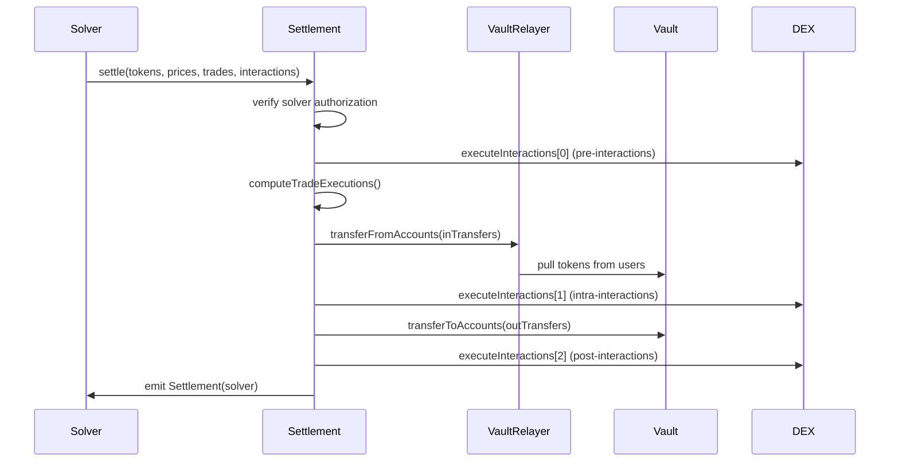

## Overview

Settlement is the core mechanism by which CoW Protocol executes trades. Unlike traditional AMMs that process orders sequentially, CoW Protocol batches multiple orders together and settles them atomically at uniform clearing prices, providing MEV protection and optimal execution.

## The Settle Function

The `settle()` function is the primary entry point for executing batches of trades:

```solidity src/contracts/GPv2Settlement.sol
function settle(
    IERC20[] calldata tokens,
    uint256[] calldata clearingPrices,
    GPv2Trade.Data[] calldata trades,
    GPv2Interaction.Data[][3] calldata interactions
) external nonReentrant onlySolver {
    executeInteractions(interactions[0]);

    (GPv2Transfer.Data[] memory inTransfers,
     GPv2Transfer.Data[] memory outTransfers
    ) = computeTradeExecutions(tokens, clearingPrices, trades);

    vaultRelayer.transferFromAccounts(inTransfers);

    executeInteractions(interactions[1]);

    vault.transferToAccounts(outTransfers);

    executeInteractions(interactions[2]);

    emit Settlement(msg.sender);
}
```

## Settlement Execution Flow



## Clearing Prices

CoW Protocol settles all trades in a batch at **uniform clearing prices**. This is fundamentally different from AMMs:

<CardGroup cols={2}>
  <Card title="Traditional AMM">
    Each trade affects price sequentially, creating MEV opportunities and worse execution for later trades
  </Card>
  <Card title="CoW Protocol">
    All trades execute at the same price vector, eliminating intra-batch MEV and ensuring fair execution
  </Card>
</CardGroup>

### Price Vector Format

Prices are passed as parallel arrays:

```solidity
IERC20[] tokens = [USDC, WETH, DAI];
uint256[] prices = [1e18, 2000e18, 1e18];
// USDC price: 1 (reference)
// WETH price: 2000 (2000 USDC per WETH)
// DAI price: 1 (1 USDC per DAI)
```

## Trade Execution

### Computing Executions (src/contracts/GPv2Settlement.sol:290)

The contract validates each trade and computes exact execution amounts:

```solidity src/contracts/GPv2Settlement.sol
function computeTradeExecution(
    RecoveredOrder memory recoveredOrder,
    uint256 sellPrice,
    uint256 buyPrice,
    uint256 executedAmount,
    GPv2Transfer.Data memory inTransfer,
    GPv2Transfer.Data memory outTransfer
) internal {
    GPv2Order.Data memory order = recoveredOrder.data;
    
    // Verify order hasn't expired
    require(order.validTo >= block.timestamp, "GPv2: order expired");
    
    // Check limit price: sellAmount * sellPrice >= buyAmount * buyPrice
    require(
        order.sellAmount.mul(sellPrice) >= order.buyAmount.mul(buyPrice),
        "GPv2: limit price not respected"
    );
    
    // Compute executed amounts based on order kind...
}
```

### Price Verification

The protocol ensures users get at least their limit price using the equation:

```
sellAmount × sellPrice ≥ buyAmount × buyPrice
```

<Note>
This formula comes from the basic economic principle that value exchanged must be equal: `amount_x × price_x = amount_y × price_y`
</Note>

## Interaction Hooks

Interactions are arbitrary smart contract calls that extend settlement capabilities:

### Three Execution Phases

<AccordionGroup>
  <Accordion title="Pre-Interactions (interactions[0])">
    Execute **before** pulling tokens from users. Common uses:
    - Unwrapping tokens (e.g., stETH → wstETH)
    - Setting up flash loans
    - Pre-funding the settlement contract
  </Accordion>
  
  <Accordion title="Intra-Interactions (interactions[1])">
    Execute **after** pulling user tokens but **before** sending tokens to users. Common uses:
    - Trading on external DEXs (Uniswap, Curve, etc.)
    - Arbitrage to balance the settlement
    - Liquidity provision
  </Accordion>
  
  <Accordion title="Post-Interactions (interactions[2])">
    Execute **after** all tokens have been distributed. Common uses:
    - Returning dust amounts
    - Claiming rewards
    - Cleanup operations
  </Accordion>
</AccordionGroup>

### Interaction Structure

```solidity src/contracts/libraries/GPv2Interaction.sol
struct Data {
    address target;   // Contract to call
    uint256 value;    // ETH to send (if any)
    bytes callData;   // Encoded function call
}
```

### Security Restrictions

The VaultRelayer cannot be targeted by interactions (src/contracts/GPv2Settlement.sol:454):

```solidity
require(
    interaction.target != address(vaultRelayer),
    "GPv2: forbidden interaction"
);
```

<Warning>
This restriction prevents malicious solvers from exploiting user approvals through the VaultRelayer.
</Warning>

## Events

The settlement process emits detailed events for monitoring:

### Trade Event

```solidity src/contracts/GPv2Settlement.sol
event Trade(
    address indexed owner,
    IERC20 sellToken,
    IERC20 buyToken,
    uint256 sellAmount,
    uint256 buyAmount,
    uint256 feeAmount,
    bytes orderUid
);
```

Emitted for each executed trade, containing full execution details.

### Interaction Event

```solidity src/contracts/GPv2Settlement.sol
event Interaction(
    address indexed target,
    uint256 value,
    bytes4 selector
);
```

Emitted for each interaction, logging the target contract and function selector.

### Settlement Event

```solidity src/contracts/GPv2Settlement.sol
event Settlement(address indexed solver);
```

Emitted once per settlement, identifying which solver executed the batch.

## Partial Fills

Orders can be marked as partially fillable, allowing execution across multiple settlements:

```solidity src/contracts/GPv2Settlement.sol
if (order.partiallyFillable) {
    executedSellAmount = executedAmount;
    executedFeeAmount = order.feeAmount.mul(executedSellAmount).div(
        order.sellAmount
    );
} else {
    // Fill-or-kill: execute entire order
    executedSellAmount = order.sellAmount;
    executedFeeAmount = order.feeAmount;
}
```

<Info>
Partial fills enable better price discovery by allowing large orders to be filled gradually as liquidity becomes available.
</Info>

## Filled Amount Tracking

The contract tracks how much of each order has been filled:

```solidity src/contracts/GPv2Settlement.sol
mapping(bytes => uint256) public filledAmount;
```

For sell orders, this tracks the cumulative `sellAmount` executed. For buy orders, it tracks the cumulative `buyAmount` received.

### Preventing Overfills

```solidity src/contracts/GPv2Settlement.sol
currentFilledAmount = filledAmount[orderUid].add(executedSellAmount);
require(
    currentFilledAmount <= order.sellAmount,
    "GPv2: order filled"
);
filledAmount[orderUid] = currentFilledAmount;
```

## Direct Balancer Integration

The `swap()` function allows direct trading against Balancer V2 pools:

```solidity src/contracts/GPv2Settlement.sol
function swap(
    IVault.BatchSwapStep[] calldata swaps,
    IERC20[] calldata tokens,
    GPv2Trade.Data calldata trade
) external nonReentrant onlySolver {
    // Recovers order and validates signature
    // Executes swap through Balancer Vault
    // Verifies limit price and deadline
    // Updates filled amount
}
```

<Note>
This is a gas-optimized path for orders that can be fully filled against Balancer liquidity without needing a complex batch settlement.
</Note>

## Gas Refunds

To incentivize cleaning up expired order storage, the contract provides refund mechanisms:

```solidity src/contracts/GPv2Settlement.sol
/// @dev Free storage from filled amounts of expired orders
function freeFilledAmountStorage(
    bytes[] calldata orderUids
) external onlyInteraction {
    freeOrderStorage(filledAmount, orderUids);
}
```

<Info>
These functions can only be called as interactions during settlement, ensuring they're batched with other operations for gas efficiency.
</Info>

## Invariants

The settlement contract enforces critical invariants:

1. **All orders are valid and signed** - Verified during order recovery
2. **Accounts have sufficient balance and approval** - Enforced by the Vault
3. **Limit prices are respected** - Checked using clearing prices
4. **Orders don't get overfilled** - Tracked via `filledAmount` mapping
5. **Settlements are atomic** - All trades execute or the entire transaction reverts
6. **No reentrancy** - Protected by `nonReentrant` modifier
