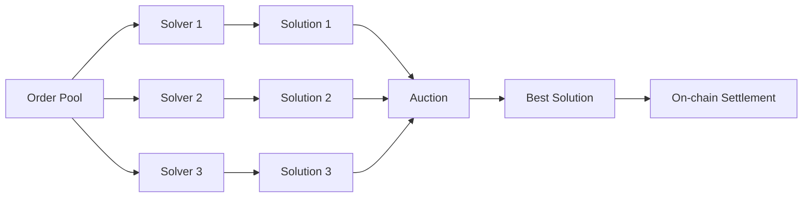

## Overview

Solvers are the backbone of CoW Protocol, responsible for finding optimal solutions to batch auction problems. They compete to provide the best execution for user orders while earning fees for their service.

## What is a Solver?

A solver is an off-chain agent that:

1. **Monitors the order pool** for new and existing orders
2. **Computes optimal settlements** by finding clearing prices and trade routes
3. **Sources liquidity** from on-chain AMMs, aggregators, and private inventory
4. **Submits settlement transactions** to the blockchain
5. **Earns rewards** for successful settlements

<Info>
Solvers run complex optimization algorithms to maximize trader surplus while ensuring all orders respect their limit prices.
</Info>

## Solver Authorization

Only authorized solvers can call the `settle()` function:

```solidity src/contracts/GPv2Settlement.sol
modifier onlySolver() {
    require(authenticator.isSolver(msg.sender), "GPv2: not a solver");
    _;
}

function settle(
    IERC20[] calldata tokens,
    uint256[] calldata clearingPrices,
    GPv2Trade.Data[] calldata trades,
    GPv2Interaction.Data[][3] calldata interactions
) external nonReentrant onlySolver {
    // Settlement logic...
}
```

### Authentication Contract

The `GPv2AllowListAuthentication` contract manages solver permissions:

```solidity src/contracts/GPv2AllowListAuthentication.sol
contract GPv2AllowListAuthentication is GPv2Authentication {
    address public manager;
    mapping(address => bool) private solvers;
    
    function isSolver(
        address prospectiveSolver
    ) external view override returns (bool) {
        return solvers[prospectiveSolver];
    }
    
    function addSolver(address solver) external onlyManager {
        solvers[solver] = true;
        emit SolverAdded(solver);
    }
    
    function removeSolver(address solver) external onlyManager {
        solvers[solver] = false;
        emit SolverRemoved(solver);
    }
}
```

<Warning>
The manager role has significant power over the protocol. Only trusted addresses should be granted this role.
</Warning>

## Solver Competition

CoW Protocol uses a competitive mechanism to ensure optimal execution:



### Solution Quality Metrics

Solutions are ranked based on:

1. **Surplus Generated**: How much better than limit price traders receive
2. **Number of Orders Filled**: More filled orders = better batch
3. **Gas Efficiency**: Lower gas costs for users
4. **Risk Score**: Probability of on-chain execution success

<Note>
The winning solver is selected off-chain, but anyone can verify that the on-chain settlement respects all order constraints.
</Note>

## Settlement Responsibilities

When a solver submits a winning solution, they must provide:

### 1. Token List

```solidity
IERC20[] calldata tokens
```

An array of all tokens involved in the settlement. Trade structures reference tokens by index.

### 2. Clearing Prices

```solidity
uint256[] calldata clearingPrices
```

Uniform prices at which all trades in the batch execute. Parallel to the `tokens` array.

### 3. Trades

```solidity src/contracts/libraries/GPv2Trade.sol
struct Data {
    uint256 sellTokenIndex;    // Index into tokens array
    uint256 buyTokenIndex;     // Index into tokens array
    address receiver;          // Order receiver
    uint256 sellAmount;        // Amount user sells
    uint256 buyAmount;         // Amount user buys
    uint32 validTo;            // Order expiration
    bytes32 appData;           // Application data
    uint256 feeAmount;         // Protocol fee
    uint256 flags;             // Encoded order properties
    uint256 executedAmount;    // Amount to fill this settlement
    bytes signature;           // User's signature
}
```

### 4. Interactions

Three arrays of contract interactions to execute at different phases:

```solidity
GPv2Interaction.Data[][3] calldata interactions
```

<AccordionGroup>
  <Accordion title="Pre-Interactions (Phase 0)">
    Executed before pulling user tokens. Used for:
    - Setting up flash loans
    - Unwrapping/wrapping tokens
    - Pre-funding the settlement contract
  </Accordion>
  
  <Accordion title="Intra-Interactions (Phase 1)">
    Executed after pulling user tokens but before distributing. Used for:
    - Trading on external DEXs (Uniswap, Curve, 1inch, etc.)
    - Rebalancing the batch through arbitrage
    - Sourcing missing liquidity
  </Accordion>
  
  <Accordion title="Post-Interactions (Phase 2)">
    Executed after all user transfers complete. Used for:
    - Repaying flash loans
    - Returning dust to solver
    - Cleanup operations
  </Accordion>
</AccordionGroup>

## Solver Economics

### Gas Costs

Solvers pay the gas costs for settlement transactions, which include:

- Base transaction cost (~21k gas)
- Order signature verification
- Token transfers (per order)
- External interaction calls
- Storage updates

<Note>
Batch settlements amortize fixed costs across multiple orders, making them more gas-efficient than individual trades.
</Note>

### Revenue Sources

1. **Protocol Fees**: Solvers retain a portion of fees collected from filled orders
2. **Surplus Capture**: Small percentage of surplus above limit prices (if any)
3. **CoW Finding**: Trading orders directly against each other earns the full surplus
4. **Arbitrage**: Profiting from price discrepancies between liquidity sources

### Risk Management

Solvers face several risks:

- **Execution Failure**: Transactions that revert waste gas costs
- **Front-running**: MEV bots may extract value from visible settlement transactions
- **Slippage**: Prices may move between solution computation and on-chain execution
- **Competition**: Other solvers may submit better solutions

## Interaction with External Liquidity

Solvers access liquidity from multiple sources:

```solidity src/contracts/libraries/GPv2Interaction.sol
struct Data {
    address target;      // Contract to call
    uint256 value;       // ETH to send
    bytes callData;      // Encoded function call
}
```

### Example: Uniswap V3 Swap

```solidity
GPv2Interaction.Data memory uniswapInteraction = GPv2Interaction.Data({
    target: UNISWAP_V3_ROUTER,
    value: 0,
    callData: abi.encodeWithSelector(
        ISwapRouter.exactInputSingle.selector,
        ISwapRouter.ExactInputSingleParams({
            tokenIn: USDC,
            tokenOut: WETH,
            fee: 3000,
            recipient: address(settlement),
            deadline: block.timestamp,
            amountIn: 10000e6,
            amountOutMinimum: 4e18,
            sqrtPriceLimitX96: 0
        })
    )
});
```

### Example: Curve Exchange

```solidity
GPv2Interaction.Data memory curveInteraction = GPv2Interaction.Data({
    target: CURVE_3POOL,
    value: 0,
    callData: abi.encodeWithSelector(
        ICurvePool.exchange.selector,
        0,     // i: USDC index
        1,     // j: USDT index  
        1000e6,    // dx: input amount
        990e6,     // min_dy: minimum output
        address(settlement)
    )
});
```

<Warning>
Solvers must ensure interaction targets are safe. The settlement contract blocks interactions with the VaultRelayer to prevent fund theft.
</Warning>

## Solver Slashing

While not implemented at the smart contract level, the protocol includes off-chain slashing mechanisms:

- **Invalid Solutions**: Submitting solutions that violate invariants
- **Failed Transactions**: Excessive revert rate reduces solver score
- **Malicious Behavior**: Attempting to extract value from users

<Info>
Slashing is enforced through the solver registry by reducing rewards and potentially removing solver authorization.
</Info>

## Manager Role

The manager controls the solver allowlist:

```solidity src/contracts/GPv2AllowListAuthentication.sol
address public manager;

modifier onlyManager() {
    require(manager == msg.sender, "GPv2: caller not manager");
    _;
}

function setManager(address manager_) external onlyManagerOrOwner {
    address oldManager = manager;
    manager = manager_;
    emit ManagerChanged(manager_, oldManager);
}
```

### Manager Responsibilities

- Add new solvers to the allowlist
- Remove misbehaving solvers
- Monitor solver performance
- Respond to security incidents

<Warning>
The manager can be changed by either the current manager or the proxy admin (contract owner).
</Warning>

## Events

Solver-related events for monitoring:

```solidity src/contracts/GPv2AllowListAuthentication.sol
event ManagerChanged(address newManager, address oldManager);
event SolverAdded(address solver);
event SolverRemoved(address solver);
```

```solidity src/contracts/GPv2Settlement.sol
event Settlement(address indexed solver);
event Interaction(address indexed target, uint256 value, bytes4 selector);
```

## Direct Balancer Swaps

For orders that can be fully filled against Balancer liquidity, solvers can use the optimized `swap()` function:

```solidity src/contracts/GPv2Settlement.sol
function swap(
    IVault.BatchSwapStep[] calldata swaps,
    IERC20[] calldata tokens,
    GPv2Trade.Data calldata trade
) external nonReentrant onlySolver {
    // Recovers order from trade
    // Executes swap through VaultRelayer
    // Validates limit price and deadline
    // Updates filled amount
    // Emits Trade and Settlement events
}
```

This path saves gas by:
- Avoiding batch settlement overhead
- Using Balancer's optimized swap routing
- Skipping interaction execution

<Note>
The `swap()` function is limited to fill-or-kill orders that can be completely satisfied by Balancer pools.
</Note>

## Becoming a Solver

To become an authorized solver:

1. **Develop Optimization Algorithm**: Build a system that can find optimal settlements
2. **Implement Settlement Logic**: Create infrastructure to submit transactions
3. **Stake (if required)**: Some deployments may require economic stake
4. **Request Authorization**: Apply to the protocol DAO/manager
5. **Monitor & Maintain**: Continuously optimize and monitor performance

<Info>
Solver authorization is permissioned to ensure protocol security and user protection during the initial phases.
</Info>
